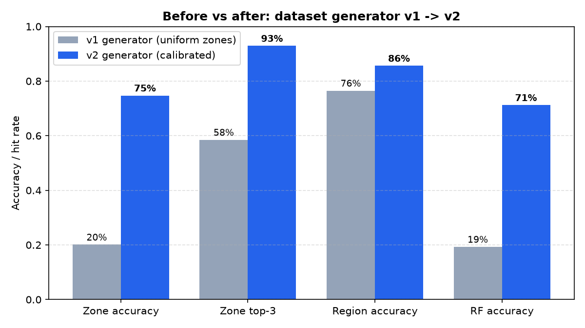
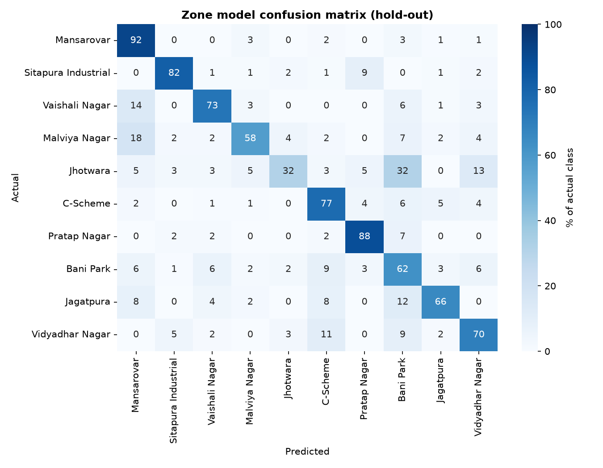
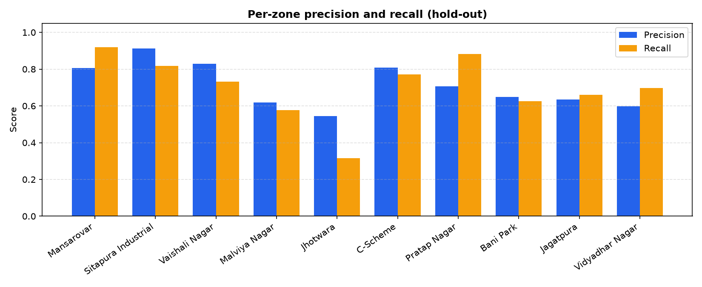
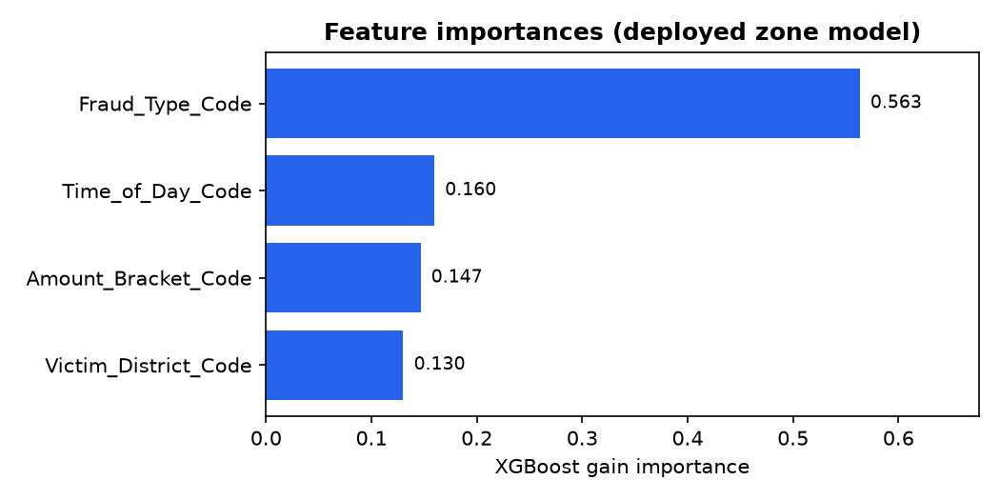
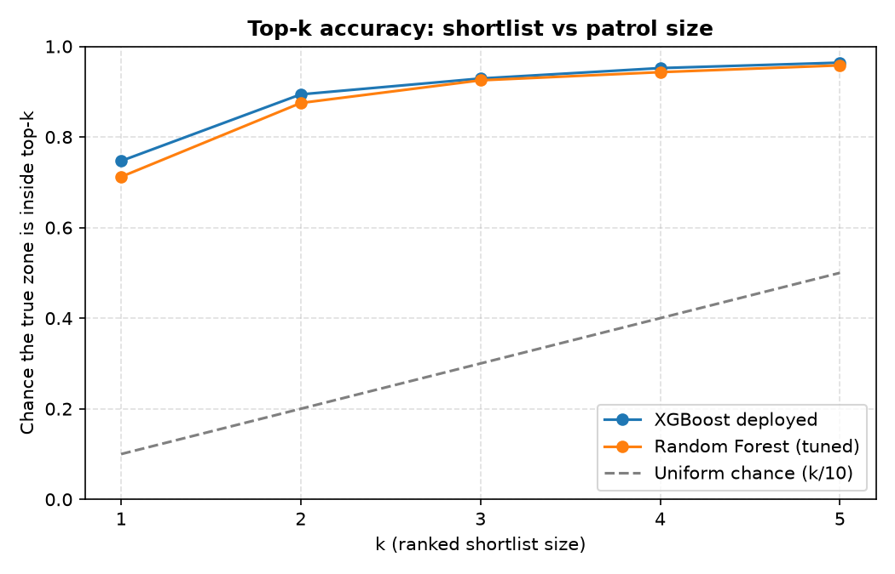
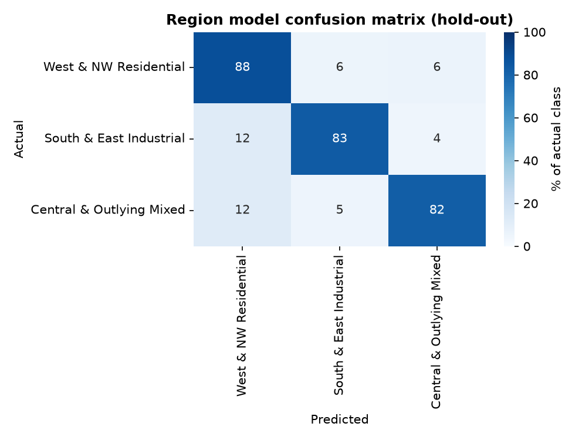

# Evaluation Report - Predictive Analytics Framework for Cybercrime Complaints

Generated on 2026-10-07 by `evaluation_report.py`.
Machine-readable version: [`metrics.json`](metrics.json).

## Headline: dataset generator v1 -> v2

| Metric | v1 (uniform zones + 20% noise) | v2 (calibrated generator) | Change |
|---|---|---|---|
| Zone accuracy (hold-out) | 0.2010 | 0.7470 | **+54.6 pp** |
| Zone top-3 hit rate | 0.5850 | 0.9290 | +34.4 pp |
| Region accuracy | 0.7650 | 0.8560 | +9.1 pp |
| Random Forest accuracy | 0.1930 | 0.7120 | +51.9 pp |



The v1 generator drew the target ATM zone with `random.choice` (uniform) and
then corrupted 20% of labels, so no complaint attributes could survive - the
zone task was capped at ~20% accuracy. The v2 generator samples the zone from
feature-dependent affinities (fraud type, time of day, amount bracket, victim
district) with a small label-noise term, which is what makes the task
learnable while staying inside the reference-calibrated marginals of the
I4C/NCRP complaint statistics cited in `dataset/dataset.py`.

## Setup

- Dataset: `dataset/jaipur_ml_ready_manual_features.csv` - 5,000 rows, 4,000 train / 1,000 test
- Split: 80/20, stratified on the zone label, `random_state=42` (same as training scripts)
- Features: Fraud_Type_Code, Victim_District_Code, Time_of_Day_Code, Amount_Bracket_Code
- Leakage columns **excluded** by policy (see `LEAKAGE_NOTES` in `atm_zone_config.py`): `Specific_ATM_Location` and `Time_to_Withdraw` would each leak the answer and are never used.
- Hold-out numbers come from the deployed artifacts `models/xgboost_atm_zone.joblib` and `models/xgboost_risk_region.joblib` - this script never retrains them.

## Stage 2 - Zone model (deployed XGBoost)

| Metric | Value |
|---|---|
| Accuracy | 0.7470 |
| Balanced accuracy | 0.6999 |
| Cohen's kappa | 0.7081 |
| MCC | 0.7088 |
| Macro F1 | 0.6998 |
| Weighted F1 | 0.7434 |
| Top-1 accuracy | 0.7470 |
| Top-3 hit rate | 0.9290 |
| Top-5 hit rate | 0.9640 |
| MRR | 0.8452 |
| ROC-AUC (OvR, macro) | 0.9373 |
| Log loss | 0.8413 |
| Brier score (lower better) | 0.3676 |

### Per-zone breakdown

| Zone | Precision | Recall | F1 | Support |
|---|---|---|---|---|
| Mansarovar | 0.806 | 0.920 | 0.859 | 199 |
| Sitapura Industrial | 0.911 | 0.818 | 0.862 | 88 |
| Vaishali Nagar | 0.829 | 0.731 | 0.777 | 119 |
| Malviya Nagar | 0.619 | 0.578 | 0.598 | 45 |
| Jhotwara | 0.545 | 0.316 | 0.400 | 38 |
| C-Scheme | 0.808 | 0.771 | 0.789 | 175 |
| Pratap Nagar | 0.707 | 0.883 | 0.785 | 60 |
| Bani Park | 0.649 | 0.625 | 0.637 | 160 |
| Jagatpura | 0.635 | 0.660 | 0.647 | 50 |
| Vidyadhar Nagar | 0.597 | 0.697 | 0.643 | 66 |

| Overall | Value |
|---|---|
| **Macro avg F1** | 0.700 |
| **Weighted avg F1** | 0.743 |

### Confusion matrix (rows = actual, cells = % of that zone)



### Precision and recall per zone



### Feature importances



### Shortlist quality



## Stage 1 - Region model (deployed XGBoost)

| Metric | Value |
|---|---|
| Accuracy | 0.8560 |
| Balanced accuracy | 0.8457 |
| Cohen's kappa | 0.7652 |
| MCC | 0.7652 |
| Macro F1 | 0.8447 |
| ROC-AUC (OvR, macro) | 0.9466 |
| Log loss | 0.3997 |
| Brier score (lower better) | 0.2126 |

### Per-region breakdown

| Region | Precision | Recall | F1 | Support |
|---|---|---|---|---|
| West & NW Residential | 0.887 | 0.881 | 0.884 | 523 |
| South & East Industrial | 0.833 | 0.833 | 0.833 | 252 |
| Central & Outlying Mixed | 0.811 | 0.822 | 0.817 | 225 |

### Confusion matrix



## Cross-validation (5-fold, stratified on the zone label)

Hold-out numbers can be lucky; these come from five retrainings on disjoint
folds of the full 5,000-row dataset.

### Zone model

| Fold | Rows | Accuracy | Macro F1 |
|---|---|---|---|
| 1 | 1000 | 0.7220 | 0.6715 |
| 2 | 1000 | 0.7400 | 0.6956 |
| 3 | 1000 | 0.7400 | 0.6862 |
| 4 | 1000 | 0.7460 | 0.7145 |
| 5 | 1000 | 0.7240 | 0.6850 |
| **Mean +/- std** | - | **0.7344 +/- 0.0096** | **0.6906 +/- 0.0142** |

### Region model

| Fold | Rows | Accuracy | Macro F1 |
|---|---|---|---|
| 1 | 1000 | 0.8530 | 0.8409 |
| 2 | 1000 | 0.8530 | 0.8413 |
| 3 | 1000 | 0.8590 | 0.8484 |
| 4 | 1000 | 0.8490 | 0.8372 |
| 5 | 1000 | 0.8440 | 0.8333 |
| **Mean +/- std** | - | **0.8516 +/- 0.0050** | **0.8402 +/- 0.0050** |

## Baselines

| Baseline | Zone accuracy | Zone top-3 |
|---|---|---|
| Majority class | 0.1990 | 0.1990 |
| Uniform random | 0.1000 | 0.3000 |
| Random Forest (100 trees) | 0.7070 | 0.9090 |
| Random Forest (tuned) | 0.7120 | 0.9250 |
| XGBoost deployed (v2) | 0.7470 | 0.9290 |
| XGBoost on v1 generator | 0.2010 | 0.5850 |
| Random Forest on v1 generator | 0.1930 | n/a |

Reading: the deployed zone model beats the strongest classical baseline
(Random Forest, tuned) and sits far above chance. The gap between it and the
~0.10 uniform / ~0.20 majority floor is the value the feature engineering adds.

## Honest limitations

1. **The data is synthetic.** Generator parameters are calibrated against
   public Indian cybercrime complaint patterns, but every row is simulated;
   real deployment needs a real complaint corpus.
2. **Region stage does not currently improve the zone top-3** (it changes the
   hit rate by under a point); its value is the interpretable ~86% belt
   call for the control room, as documented in `risk_cluster_model.py`.
3. **Class imbalance remains.** The largest zone holds
   20% of the test set; the weighted variant trades ~3 points of
   accuracy for minority recall and is kept as a comparison, not shipped.
4. Both leakage columns are excluded by policy, not by accident - accuracy
   obtained from them would be meaningless.

## Reproduce

```text
py -3.13 dataset/dataset.py
py -3.13 data_preprocessing.py
py -3.13 feature_engineering.py
py -3.13 risk_cluster_model.py
py -3.13 xgboost_model.py
py -3.13 random_forest_model.py
py -3.13 evaluation_report.py
```
